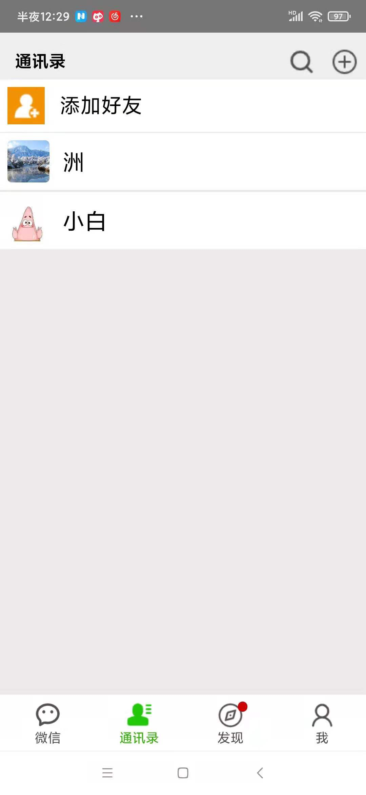
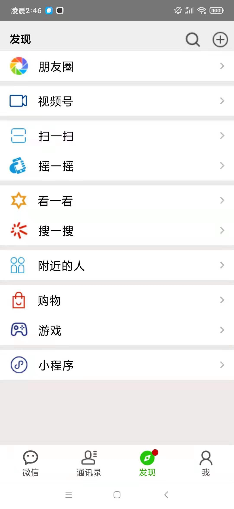
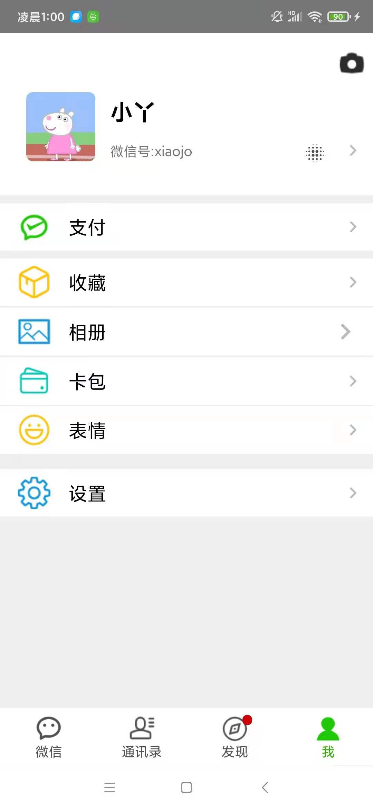
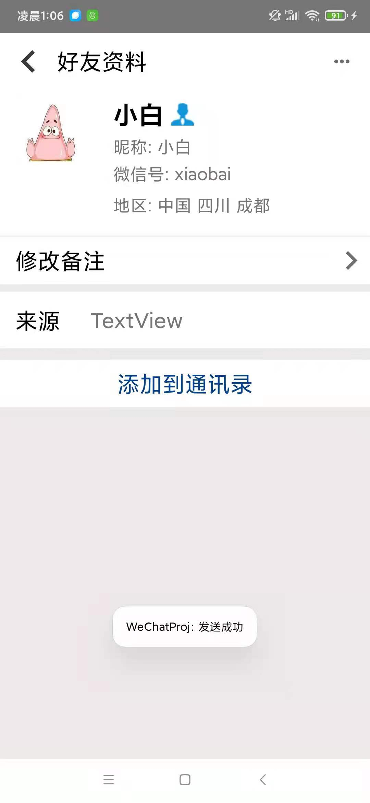
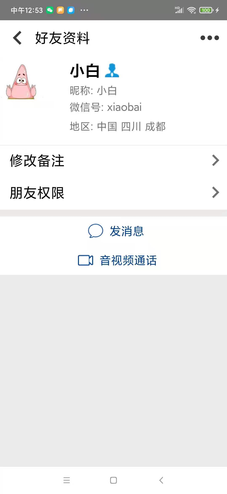
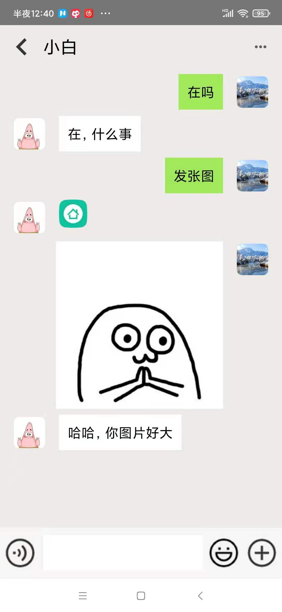
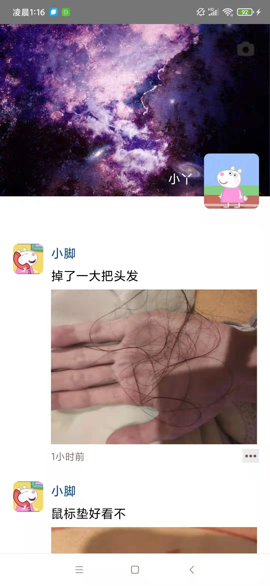
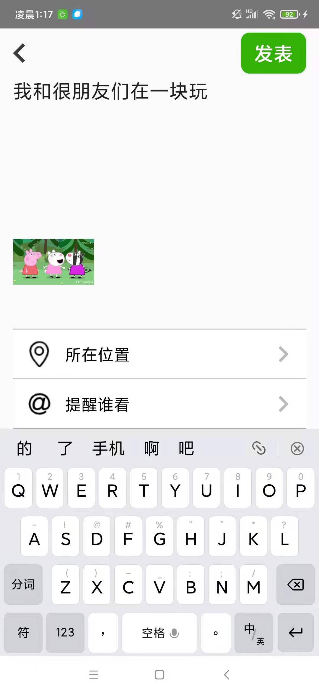
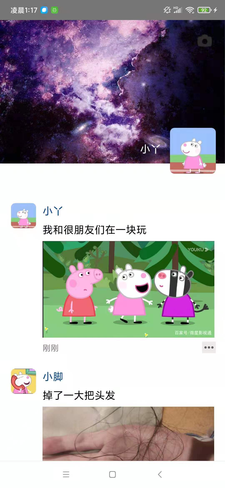
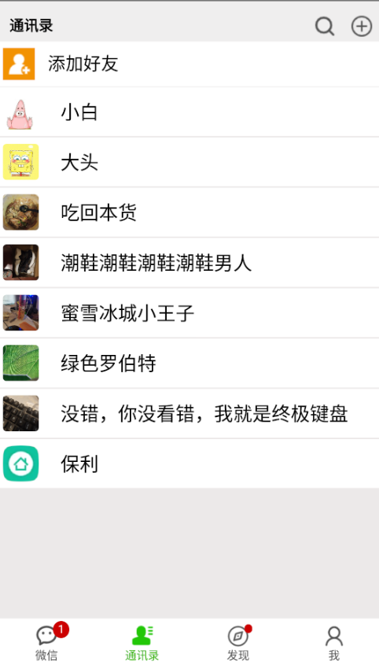

# Wechat-Android-DZ
It's an imitation of Wechat(Android), which has UserSystem,FriendSystem,ChatSystem and a local FirendCircle. This respository includes two projects: client &amp; server. 
这是一个模仿微信的安卓项目，包含用户系统，好友系统，聊天系统和一个本地朋友圈（实际上是服务端还没做，仅完成一小半）。这个仓库里有两个项目：客户端和服务器。 

This is link of the Server. 
这是服务端的链接： 
[Wechat-DZ-Server](https://github.com/Joe-Deng/Wechat-DZ-Server) 
这是Gitee的链接： 
[Wechat-DZ-Server(Gitee)](https://github.com/Joe-Deng/Wechat-DZ-Server) 

Now I'll show you what it looks like. 
现在我给你展示一下长什么样。 

# 手机端(Mobie Phone)
 
 
 
 
 
 
 
 
 
 

# 模拟器端(Visual Driver)
 
 
